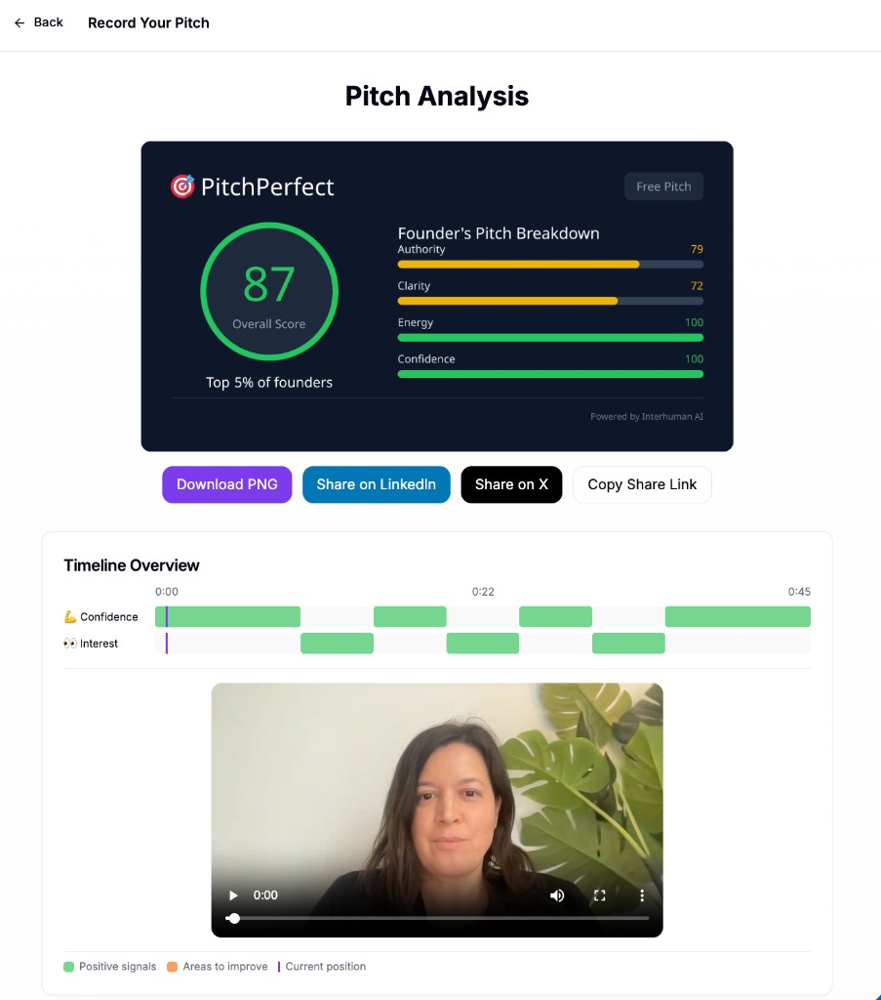

# The Pitch Practice - AI-Powered Investor Pitch Practice

An example application demonstrating how to build with [Interhuman AI's](https://interhuman.ai) social signal analysis API. This app helps founders practice their investor pitches with real-time feedback on confidence, clarity, energy, and more.



[](https://vercel.com/new/clone?repository-url=https%3A%2F%2Fgithub.com%2FInterhumanAI%2Finterhuman-example-pitch&project-name=the-pitch-practice&repository-name=the-pitch-practice&env=INTERHUMAN_API_KEY&envDescription=Your%20Interhuman%20API%20key%20is%20required%20for%20pitch%20analysis.%20Supabase%20vars%20are%20optional%20for%20the%20leaderboard.&envLink=https%3A%2F%2Fdocs.interhuman.ai%2Fhow-to%2Fget-api-key)

## Features

- **Pitch Recording & Analysis**: Record your pitch and get AI-powered feedback on delivery
- **1-Minute Pitch Challenge**: Timed challenge with leaderboard and badges
- **Q&A Practice Mode**: Interactive learning to identify and reframe investor questions
- **Prevention vs. Promotion Training**: Learn to reframe defensive answers into growth-focused responses
- **Social Share Cards**: Generate PNG images of your pitch scores for sharing on LinkedIn/X
- **Real-time Leaderboard**: Compete with other founders and track your ranking
- **Local Video Storage**: Videos are stored in your browser (IndexedDB), never uploaded to our servers

## Data Storage

| Data | Where | Notes |
|------|-------|-------|
| Video recordings | Browser (IndexedDB) | Cached locally |
| Analysis results | Browser (IndexedDB) | Cached locally for "View Results" |
| Pitch scores | Supabase (optional) | For leaderboard and percentile calculations |


## Tech Stack

- **Framework**: Next.js 14 (App Router)
- **Styling**: Tailwind CSS + shadcn/ui
- **Database**: Supabase (PostgreSQL) - optional, for leaderboard
- **Video**: MediaRecorder API
- **Charts**: Recharts
- **AI Analysis**: Interhuman AI API
- **Image Generation**: @vercel/og (Open Graph images)

## Getting Started

### Prerequisites

- Node.js 18+
- [Interhuman AI](https://interhuman.ai) API key ([get one](https://docs.interhuman.ai/how-to/get-api-key))
- [Supabase](https://supabase.com) account (optional, for leaderboard)

### Installation

1. Install dependencies:
```bash
cd the-pitch-practice
npm install
```

2. Set up environment variables:
```bash
cp .env.example .env
```

3. Edit `.env` with your values (see Environment Variables section below)

4. Start the development server:
```bash
npm run dev
```

Open [http://localhost:3000](http://localhost:3000) to see the app.

## Environment Variables

| Variable | Required | Description |
|----------|----------|-------------|
| `INTERHUMAN_API_KEY` | Yes | Your Interhuman API key (server-side only; do not use `NEXT_PUBLIC_*`) |
| `NEXT_PUBLIC_SUPABASE_URL` | No | Supabase project URL (for leaderboard) |
| `NEXT_PUBLIC_SUPABASE_ANON_KEY` | No | Supabase publishable key (`sb_publishable_...`) |
| `SUPABASE_SERVICE_ROLE_KEY` | No | Supabase secret key (`sb_secret_...`; server-side only) |
| `NEXT_PUBLIC_APP_URL` | No | Public site URL used for share links and metadata |

Example `.env`:
```env
INTERHUMAN_API_KEY=your_api_key
NEXT_PUBLIC_APP_URL=https://thepitchpractice.com

# Optional - for leaderboard persistence
NEXT_PUBLIC_SUPABASE_URL=https://your-project.supabase.co
NEXT_PUBLIC_SUPABASE_ANON_KEY=sb_publishable_your_publishable_key_here
SUPABASE_SERVICE_ROLE_KEY=sb_secret_your_secret_key_here
```

## Supabase Setup (Optional)

The app works without Supabase - you just won't have a persistent leaderboard.

### 1. Create a Supabase Project

1. Go to [supabase.com](https://supabase.com) and create a free project
2. Go to **Project Settings → API**
3. Copy the **Project URL** and **publishable** key (`sb_publishable_...`) to your `.env`
4. Copy the **secret** key (`sb_secret_...`) to `SUPABASE_SERVICE_ROLE_KEY` (keep this server-side only)

### 2. Create Database Tables

1. Go to **SQL Editor** in your Supabase dashboard
2. Create a new query
3. Copy the contents of `supabase/schema.sql` and run it

## Project Structure

```
src/
├── app/
│   ├── page.tsx                    # Landing page
│   ├── pitch/record/page.tsx       # Free pitch recording
│   ├── challenge/page.tsx          # 1-minute challenge
│   ├── qa-practice/page.tsx        # Q&A practice mode
│   ├── leaderboard/page.tsx        # Leaderboard
│   ├── my-videos/page.tsx          # Saved videos management
│   ├── privacy/page.tsx            # Privacy policy
│   ├── terms/page.tsx              # Terms of service
│   ├── share/[id]/page.tsx         # Shareable results page
│   └── api/
│       ├── pitch/analyze/route.ts  # Video analysis endpoint
│       ├── leaderboard/route.ts    # Leaderboard API
│       └── share/image/route.tsx   # Share card image generation
├── components/
│   ├── video-recorder.tsx          # Webcam recording
│   ├── results-display.tsx         # Analysis results
│   ├── signal-timeline.tsx         # Engagement timeline
│   ├── badge-display.tsx           # Share cards and social sharing
│   └── header.tsx                  # Navigation header
├── lib/
│   ├── interhuman.ts               # Interhuman API client
│   ├── scoring.ts                  # Score calculations
│   ├── db.ts                       # Supabase client
│   ├── video-storage.ts            # IndexedDB local video storage
│   ├── video-compression.ts        # Client-side video compression
│   └── utils.ts                    # Utilities
└── types/
    └── index.ts                    # TypeScript types

supabase/
└── schema.sql                      # Database schema
```

## Interhuman API Integration

The app uses Interhuman AI's video analysis API to detect social signals and calculated conversation quality scores. Here's a simplified example of how the integration works:

```typescript
// lib/interhuman.ts
const response = await fetch("https://api.interhuman.ai/v1/upload/analyze", {
  method: "POST",
  headers: {
    Authorization: `Bearer ${process.env.INTERHUMAN_API_KEY}`,
  },
  body: formData, // Contains the video file
});

const analysis = await response.json();
// Returns: engagement_state, signals
```

The API returns:

- **Engagement States**: engaged, disengaged, neutral (with timestamps)
- **Social Signals**: confidence, hesitation, stress, uncertainty, agreement, etc.
- **Conversation Quality**: clarity, authority, energy, rapport, learning (0-100 scores) (optional - include additional param)

See the [Interhuman API documentation](https://docs.interhuman.ai) for more details.

## Prevention vs. Promotion Questions

This app includes training based on research by Kanze et al. showing that investors ask different question types based on unconscious bias:

- **Promotion questions** focus on gains, growth, and opportunity
- **Prevention questions** focus on losses, risks, and defense

Founders who reframe prevention questions with promotion-focused answers raise 7x more money. The Q&A Practice mode helps founders develop this skill.

## Deployment

### Vercel (Recommended)

[](https://vercel.com/new/clone?repository-url=https%3A%2F%2Fgithub.com%2FInterhumanAI%2Finterhuman-example-pitch&project-name=the-pitch-practice&repository-name=the-pitch-practice&env=INTERHUMAN_API_KEY&envDescription=Your%20Interhuman%20API%20key%20is%20required%20for%20pitch%20analysis.%20Supabase%20vars%20are%20optional%20for%20the%20leaderboard.&envLink=https%3A%2F%2Fdocs.interhuman.ai%2Fhow-to%2Fget-api-key)

The deploy flow prompts for `INTERHUMAN_API_KEY`, which is required for pitch analysis. Add the optional Supabase variables later if you want persistent leaderboard data.

#### Manual import

1. Push your code to GitHub
2. Import the repo in [Vercel](https://vercel.com)
3. Add your environment variables in Vercel's dashboard
4. Set `NEXT_PUBLIC_APP_URL` to your production URL (for example, `https://thepitchpractice.com`)

## License

MIT - See [LICENSE](LICENSE) for details.

---

## About Interhuman AI

[Interhuman AI](https://interhuman.ai) provides APIs for understanding human behavior in video. Use it to build applications that analyze presentations, interviews, customer calls, and more.

- [API Documentation](https://docs.interhuman.ai)
- [Get API Keys](https://interhuman.ai)

---

## Future Improvements

Here are ideas for extending this example application:

### Advanced Q&A Practice
- **AI-Generated Questions**: Use LLMs to generate contextual follow-up questions based on founders words and behavioral cures
- **Mock Interview Mode**: Full simulated investor Q&A with AI-generated questions
- **Industry-Specific Questions**: Question banks tailored to SaaS, hardware, biotech, etc.
- **Difficulty Progression**: Adaptive difficulty based on user performance

### Gamification & Engagement
- **Daily Challenges**: Rotating prompts like "Pitch your product in 30 seconds"
- **Streak Tracking**: Reward consistent practice with badges
- **Achievement System**: Unlock badges for milestones (10 pitches, first 80+ score, etc.)
- **Team Leaderboards**: Allow companies to create private leaderboards for their team
- **Brag Rights**: Allow teams to share when they got their funding

### Collaboration Features
- **Pitch Sharing**: Let users share specific pitches with mentors for feedback
- **Comment System**: Allow mentors to leave timestamped feedback on recordings
- **A/B Testing**: Record multiple versions and compare scores side-by-side
- **Peer Review**: Anonymous pitch review system with community feedback

### Analytics & Insights
- **Progress Dashboard**: Track improvement over time with charts and trends
- **Weakness Identification**: Automatically identify areas needing the most work
- **Benchmark Comparisons**: Compare against successful pitches (with permission)
- **Export Reports**: Generate PDF reports for accelerator applications

### Technical Enhancements
- **User Authentication**: Add login to track progress across devices
- **Mobile App**: Native iOS/Android apps for practice on-the-go
- **Video Editing**: Trim and edit recordings before analysis
- **Background Blur**: Privacy-focused recording with background removal
- **API keys management**: Allow users to add their own config for AI services
- **Add payments**: Integrate a payment service like Stripe or similar to ask for signups after a few free practice tests

### Integration Ideas
- **Calendar Integration**: Schedule practice sessions with reminders
- **Slack/Discord Bots**: Share scores and achievements in team channels
- **CRM Integration**: Track pitch practice alongside investor outreach
- **Accelerator Dashboards**: White-label version for Y Combinator, Techstars, Antler etc.
